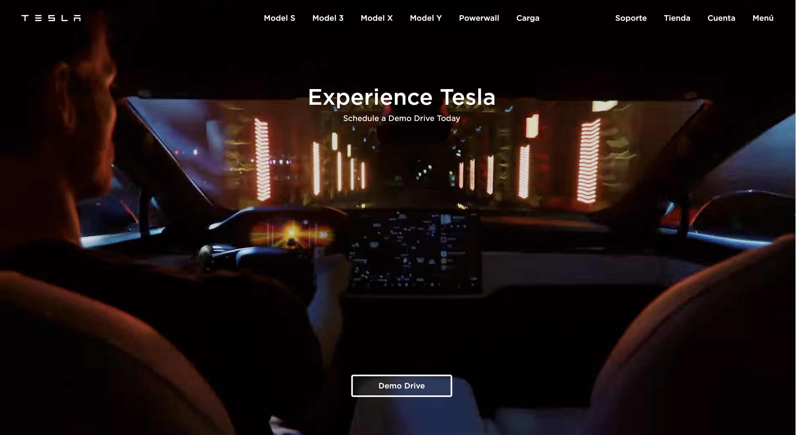

<p align="center" style="margin-center:8%">

</p>

<p align="center" style="margin-center:8%"> If you want to see the project: https://tesla-landing-laiaruizm.netlify.app/
</p>

# TESLA LANDING PAGE | LaiaRuizM

- Hi there people! 👋🏻
- My name is Laia Ruiz Martínez and this a JavaScript's project called **Tesla landing**.

## -- About this project 📋🙋🏼‍♀️ --

- I have developed almost the same Tesla's landing website but without any functionality.
  Welcome to a project where I have had the fortune of facing new challenges and learning the Astro and Tailwind frameworks.
  Welcome on board!

## -- Screenshots --

<p align="center" style="margin-center:8%">
<video
autoplay
muted
loop
src="./src/imagesVideos/website.mov">
</video>
</p>

## -- Table of contents --

- [Overview](#overview)
  - [Links](#links)
  - [Further implementations](#further-implementations)
- [Project's process](#projects-process)
  - [Landing](#landing)
  - [Built with programming languages & tools 🛠️](#built-with)
  - [Setup for getting started](#setup)
  - [Challenges I have faced 🤖](#challenges)
- [Author](#author)
- [Additional information for the setup](#additional-information)

## Overview

### Links

- Project's website: [https://tesla-landing-laiaruizm.netlify.app/](https://tesla-landing-laiaruizm.netlify.app/)

### Further implementations

- Add functionality.

## Project's process

### Landing

<p align="center" style="margin-center:8%">

</p>

### Built with

- HTML5 📌
- CSS3 🔗
- JavaScript 🤖
- Astro ⊛
- Tailwind ✏️
- Git / GitHub 📂
- VISUAL STUDIO CODE (VSC) 🗄️
- Netlify drop 💡

### Setup

1. Clone the repo: `https://tesla-landing-laiaruizm.netlify.app/` using:

```bash
 git clone
```

2. Once you've download or cloned the project, install it with NPM packages:

```bash
npm install
```

3.  After that, if you want to run it in local, execute this command:

```bash
npm run dev
```

### Challenges

- Create the different slides.
- Use the effect above the header sections.

## Author

💡 If you want to contact me for any suggestion, doubts, contributions, PullRequest. Feel free to ask me if you have any question or curiosity:

- Email: [laia.ruizm@hotmail.com](laia.ruizm@hotmail.com)
- Linkedin: [https://www.linkedin.com/in/laia-ruiz-martínez/](https://www.linkedin.com/in/laia-ruiz-martínez/)
- GitHub: [https://github.com/LaiaRuizM](https://github.com/LaiaRuizM)

«All you need is attitude. Aim for the stars so that if you miss, you will still get to the moon». 🙋🏼‍♀️

Made with 💙 by [Laia](https://github.com/LaiaRuizM)

## Additional information

### 🚀 Project Structure

Inside of your Astro project, you'll see the following folders and files:

```
/
├── public/
│   └── favicon.svg
│   └── model-x.avif
│   └── model-y.avif
│   └── solar-panels.avif
│   └── video.webm
├── src/
│   ├── components/
│   │   └── Card.astro
│   ├── layouts/
│   │   └── HeroSection.astro
│   │   └── LandingHeader.astro
│   │   └── Logo.astro
│   │   └── ModelX.astro
│   │   └── ModelY.astro
│   │   └── Section.astro
│   │   └── SolarPanels.astro
│   └── pages/
│       └── index.astro
└── package.json
```

Astro looks for `.astro` or `.md` files in the `src/pages/` directory. Each page is exposed as a route based on its file name.

There's nothing special about `src/components/`, but that's where we like to put any Astro/React/Vue/Svelte/Preact components.

Any static assets, like images, can be placed in the `public/` directory.

### What can I find in this exercise?

> **NOTE:** In this exercise, you can find the following files and folders:

1. The folder 📂 `src/` contains the files for this website: HTML, SCSS, JavaScript, and images.
1. The folders 📚 `public/` and `docs/` are automatically generated when we start the project. GULP reads the files in the src/ folder, processes them, and then generates them inside the `public/` and `docs/` folders.
1. The folder 📂 `dist/` is automatically generated when we deploy the project to Netlify's website.
1. The individual files 📝 that are loose in the repository root, such as gulpfile.js, package.json... are the project configuration files and we do not need to modify them.

### How can I start from scratch?

> **NOTE:** Below are the steps to follow:

1. **Make sure you have Node JS installed / install it** to work with the Starter Kit.
1. **Create your own repository**. NOTE: Be very aware of the folder where you are at all times.
1. Download the **Adalab Starter Kit from GitHub**.
   - As a recommendation: Avoid cloning the repo, because if you do, you won't be able to add commits.
1. **Copy all the files** from the Starter kit to the root folder of your repository.
   - Remember to copy also the **hidden files** (IMPORTANT!)
   - If you decide to clone the repo, avoid copying the `.git` folder. Because, if you do, you will be overwriting your own repository.
1. **Open a terminal** in the **root** folder of your repository.
1. **Install the local dependencies** by executing the command in the terminal:

```bash
   npm install
```

1. To start a template basics execute the command in the terminal:

```
npm create astro@latest -- --template basics
```

### 🧞 Commands

All commands are run from the root of the project, from a terminal:

| Command                   | Action                                           |
| :------------------------ | :----------------------------------------------- |
| `npm install`             | Installs dependencies                            |
| `npm run dev`             | Starts local dev server at `localhost:3000`      |
| `npm run build`           | Build your production site to `./dist/`          |
| `npm run preview`         | Preview your build locally, before deploying     |
| `npm run astro ...`       | Run CLI commands like `astro add`, `astro check` |
| `npm run astro -- --help` | Get help using the Astro CLI                     |
